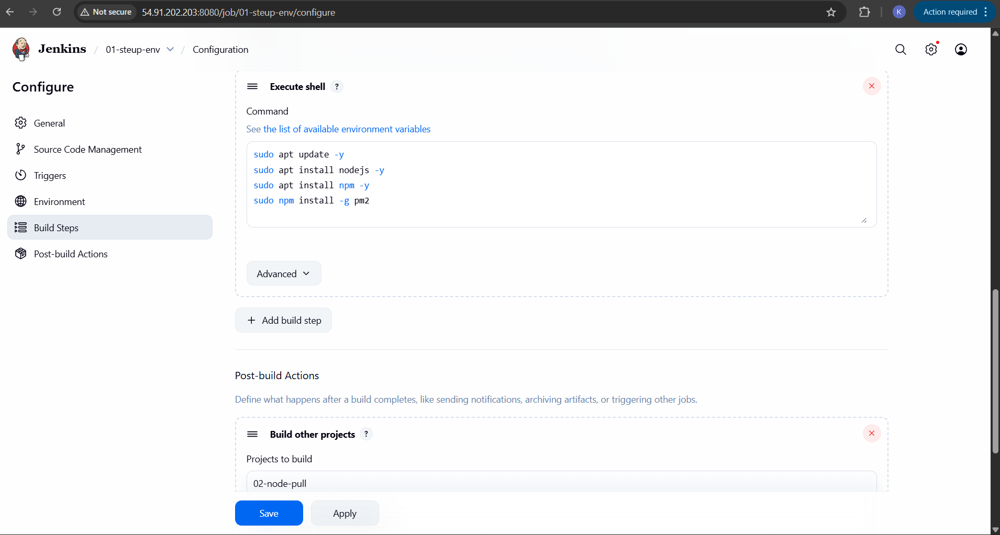
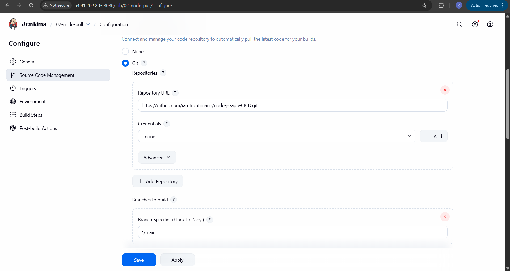
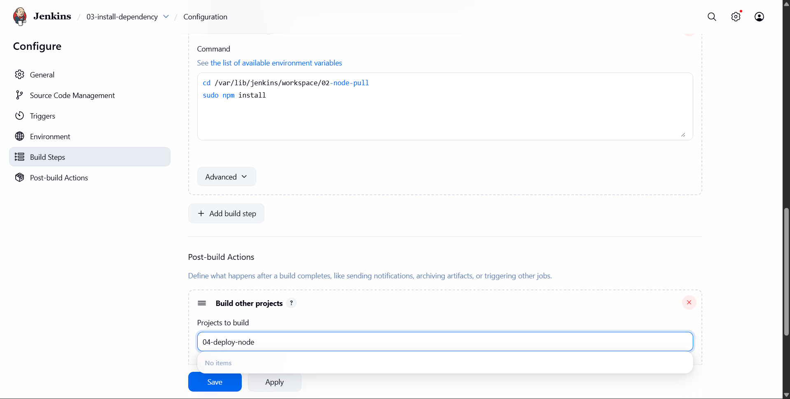
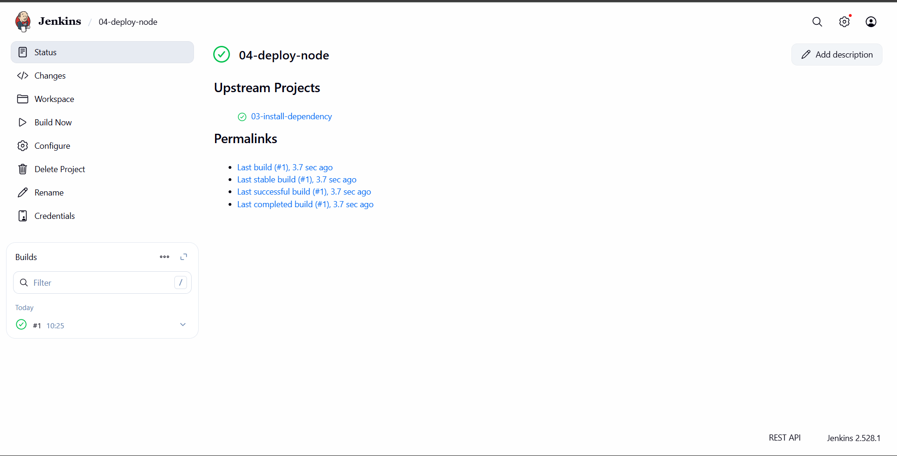
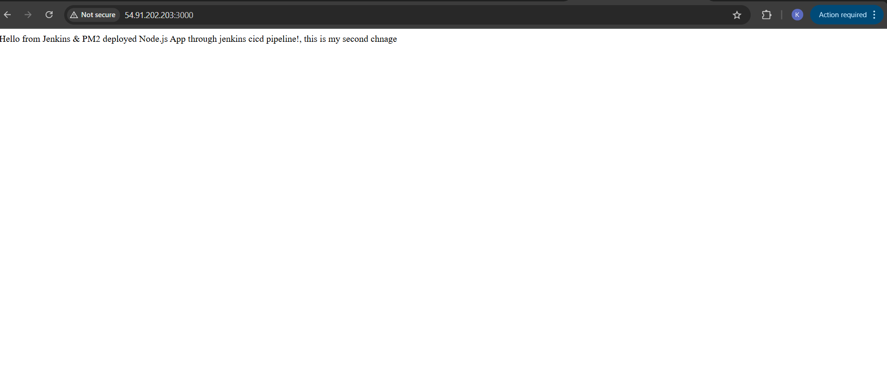

# Freestyle Node App Development 
### Install Node.js, npm, PM2 for Jenkins user
---

## Job 1:  Run these commands on your server:

####  Explanation of each command:

## 1) sudo apt update -y

 Updates the package list on your server to make sure you have the latest package versions available.

 ## 2) sudo apt install nodejs -y

 Installs Node.js, which is the JavaScript runtime required to run Node applications.

## 3) sudo apt install npm -y

 Installs npm (Node Package Manager), used to install JavaScript libraries and dependencies.

## 4) sudo npm install -g pm
 Installs PM2 globally. PM2 is a process manager for Node.js applications.

 It keeps your Node app running in the background (useful for deployment).

----
---
## Job 2: Pull Repository

 This job (02-node-pull) comes after my first job (01-steup-env) — which sets up Node.js and PM2.
The purpose of this job is to pull (clone) my Node.js project from GitHub so that Jenkins can build or deploy it.

## Job 3: Install Dependencies

--Job Purpose--

This job’s purpose is to install all Node.js dependencies for the Node project that was cloned in the previous job (02-node-pull).

It ensures that my application has all the required modules before deployment.

## 🔍 Explanation:

### 1) cd /var/lib/jenkins/workspace/02-node-pull

 Moves into the workspace directory of your previous job (02-node-pull) where your project was cloned from GitHub.

Every Jenkins job has its own workspace under /var/lib/jenkins/workspace/<job-name>.

### 2) sudo npm install

Installs all the dependencies listed in your project’s package.json file.

This prepares your Node.js application for deployment (it downloads all the necessary npm modules).

----
## Job 4: Deploy Application
 
#### Here All Jobs are Successfully Builds

#### Here Jenkins EC2 server is successfully up and running, and Jenkins should be accessible via its public IP on port 8080.

 Node App is Successfully Deploy

